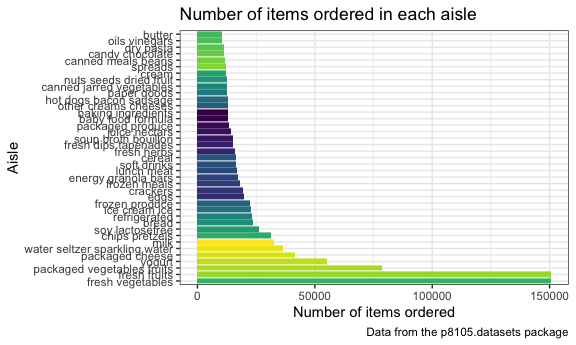
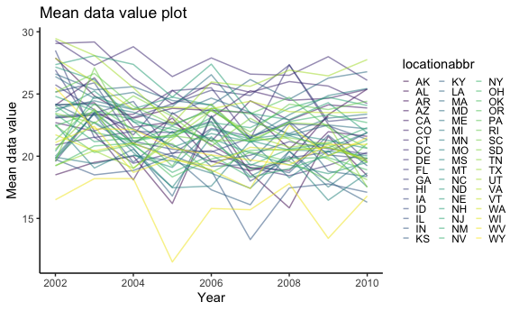
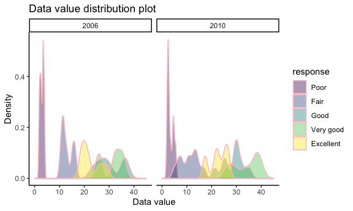
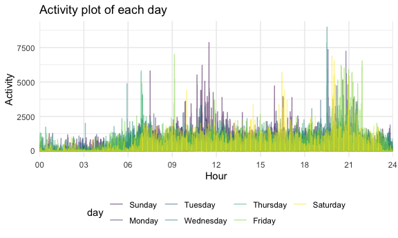

hw3
================
Hao Zheng(hz2772)

library packages and set plot size

## Problem 1

**Q:** Description of “instacart” data

``` r
data("instacart")
## description
skimr::skim(instacart)
```

**A:** This dataset has 1384617 rows and 15 columns, and 4 variables are
character type, like eval\_set and product\_name, and 11 variables are
numeric type, like order\_id and product\_id. We can observe from the
data that the product whose id is 49683 has been purchased 2413 times.

**Q:** How many aisles are there, and which aisles are the most items
ordered from?

``` r
instacart %>% 
  count(aisle,sort = TRUE) %>%
  base::nrow() # return the number of rows
```

    ## [1] 134

``` r
instacart %>% 
  count(aisle,sort = TRUE) %>%
  slice(1:1) %>%
  select(aisle)
```

    ## # A tibble: 1 × 1
    ##   aisle           
    ##   <chr>           
    ## 1 fresh vegetables

**A:** There are 134 aisles, and fresh vegetables are the most items
ordered from.

**Q:** Make a plot that shows the number of items ordered in each aisle,
limiting this to aisles with more than 10000 items ordered. Arrange
aisles sensibly, and organize your plot so others can read it.

``` r
instacart %>%
  count(aisle,sort = TRUE) %>%
  filter(n >= 10000) %>%
  rename(number = n) %>%
  mutate(aisle = fct_relevel(aisle, c(aisle))) %>%
  ggplot(aes(x = aisle, y = number, fill = rainbow(39))) + 
  geom_bar(stat = "identity") + 
  guides(fill=FALSE) +
  coord_flip() +
  labs(
    title = "Number of items ordered in each aisle",
    x = "Aisle",
    y = "Number of items ordered",
    caption = "Data from the p8105.datasets package"
  ) +
  theme_bw() 
```

    ## Warning: `guides(<scale> = FALSE)` is deprecated. Please use `guides(<scale> =
    ## "none")` instead.



**A:** The outcome is the plot.

**Q:** Make a table showing the three most popular items in each of the
aisles “baking ingredients”, “dog food care”, and “packaged vegetables
fruits”. Include the number of times each item is ordered in your table.

``` r
baking_count = 
  instacart %>%
  filter(aisle == "baking ingredients") %>%
  count(product_name,aisle,sort = TRUE) %>%
  slice(1:3)

dogfd_count = 
  instacart %>%
  filter(aisle == "dog food care") %>%
  count(product_name,aisle,sort = TRUE) %>%
  slice(1:3)
  
pcdvg_count = 
  instacart %>%
  filter(aisle == "packaged vegetables fruits") %>%
  count(product_name,aisle,sort = TRUE) %>%
  slice(1:3)

three_aisles = 
  rbind(
    baking_count,
    dogfd_count,
    pcdvg_count
  ) %>%
  rename(number = n) 

three_aisles %>%
  knitr::kable()
```

| product\_name                                 | aisle                      | number |
|:----------------------------------------------|:---------------------------|-------:|
| Light Brown Sugar                             | baking ingredients         |    499 |
| Pure Baking Soda                              | baking ingredients         |    387 |
| Cane Sugar                                    | baking ingredients         |    336 |
| Snack Sticks Chicken & Rice Recipe Dog Treats | dog food care              |     30 |
| Organix Chicken & Brown Rice Recipe           | dog food care              |     28 |
| Small Dog Biscuits                            | dog food care              |     26 |
| Organic Baby Spinach                          | packaged vegetables fruits |   9784 |
| Organic Raspberries                           | packaged vegetables fruits |   5546 |
| Organic Blueberries                           | packaged vegetables fruits |   4966 |

**A:** The outcome is the table.

**Q:** Make a table showing the mean hour of the day at which Pink Lady
Apples and Coffee Ice Cream are ordered on each day of the week; format
this table for human readers (i.e. produce a 2 x 7 table).

``` r
instacart %>%
  filter(product_name %in% c("Pink Lady Apples","Coffee Ice Cream")) %>%
  select(product_name,order_hour_of_day,order_dow) %>%
  group_by(product_name,order_dow) %>%
  summarise(mean_hour = mean(order_hour_of_day)) %>%
  pivot_wider(
    names_from = "order_dow",
    values_from = "mean_hour"
  ) %>%
  knitr::kable()
```

    ## `summarise()` has grouped output by 'product_name'. You can override using the `.groups` argument.

| product\_name    |        0 |        1 |        2 |        3 |        4 |        5 |        6 |
|:-----------------|---------:|---------:|---------:|---------:|---------:|---------:|---------:|
| Coffee Ice Cream | 13.77419 | 14.31579 | 15.38095 | 15.31818 | 15.21739 | 12.26316 | 13.83333 |
| Pink Lady Apples | 13.44118 | 11.36000 | 11.70213 | 14.25000 | 11.55172 | 12.78431 | 11.93750 |

**A:** The outcome is the table.

## Problem 2

**Q:** Data cleaning

``` r
data("brfss_smart2010") 
brfss = 
  brfss_smart2010 %>%
  janitor::clean_names() %>%
  filter(topic == "Overall Health") %>%
  mutate(response = forcats::fct_relevel(response, c("Poor","Fair","Good","Very good","Excellent")))
```

**Q:** In 2002, which states were observed at 7 or more locations? What
about in 2010?

``` r
brfss %>%
  select(year, locationabbr, locationdesc) %>%
  filter(year == 2002) %>%
  group_by(year,locationabbr) %>%
  summarise(state_location = n_distinct(locationdesc)) %>%
  filter(state_location >= 7) %>%
  select(locationabbr) %>%
  c()
```

    ## $year
    ## [1] 2002 2002 2002 2002 2002 2002
    ## 
    ## $locationabbr
    ## [1] "CT" "FL" "MA" "NC" "NJ" "PA"

``` r
brfss %>%
  select(year, locationabbr, locationdesc) %>%
  filter(year == 2010) %>%
  group_by(year,locationabbr) %>%
  summarise(state_location = n_distinct(locationdesc)) %>%
  filter(state_location >= 7) %>%
  select(locationabbr) %>%
  c()
```

    ## $year
    ##  [1] 2010 2010 2010 2010 2010 2010 2010 2010 2010 2010 2010 2010 2010 2010
    ## 
    ## $locationabbr
    ##  [1] "CA" "CO" "FL" "MA" "MD" "NC" "NE" "NJ" "NY" "OH" "PA" "SC" "TX" "WA"

**A:** In 2002, states that were observed at 7 or more locations are
“CT”, “FL”, “MA”, “NC”, “NJ” and “PA”. In 2010, states that were
observed at 7 or more locations are “CA”, “CO”, “FL”, “MA”, “MD”, “NC”
,“NE” ,“NJ”, “NY”, “OH”, “PA”, “SC”, “TX” and “WA”.

**Q:** Construct a dataset that is limited to Excellent responses, and
contains, year, state, and a variable that averages the data\_value
across locations within a state. Make a “spaghetti” plot of this average
value over time within a state (that is, make a plot showing a line for
each state across years – the geom\_line geometry and group aesthetic
will help).

``` r
brfss %>%
  filter(response == "Excellent") %>%
  drop_na(data_value) %>%
  select(year, locationabbr, locationdesc, response, data_value) %>%
  group_by(year, locationabbr) %>%
  summarise(state_mean = mean(data_value)) %>%
  ## plot
  ggplot(aes(x = year, y = state_mean, color = locationabbr))+
  geom_line(alpha = .522, size =0.522) + 
  labs(
    title = "Mean data value plot",
    x = "Year",
    y = "Mean data value"
  ) + 
  theme_classic() + 
  theme(legend.position = "right", legend.key.size=unit(2,'mm'))
```

    ## `summarise()` has grouped output by 'year'. You can override using the `.groups` argument.



**A:** The plot shows lines of mean data\_value for each state across
years.

**Q:** Make a two-panel plot showing, for the years 2006, and 2010,
distribution of data\_value for responses (“Poor” to “Excellent”) among
locations in NY State.

``` r
brfss %>%
  filter(response %in% c("Poor","Fair","Good","Very good","Excellent"), 
         year %in% c(2006,2010),
         locationabbr == "NY"
  ) %>%
  group_by(response) %>%
  ggplot(aes(x = data_value, fill = response)) + 
  geom_density(alpha = .4, adjust = .5, color = "pink") + 
  scale_x_continuous(limits = c(0,45)) +
  labs(
    title = "Data value distribution plot",
    x = "Data value",
    y = "Density"
  ) +  
  facet_grid(. ~ year) +
  theme_classic() + 
  theme(legend.position = "right")
```



**A:** The plot shows the distribution of data\_value for responses
(“Poor” to “Excellent”) among locations in NY State.

## Problem 3

**Q:** Load, tidy, and otherwise wrangle the data. Your final dataset
should include all originally observed variables and values; have useful
variable names; include a weekday vs weekend variable; and encode data
with reasonable variable classes. Describe the resulting dataset
(e.g. what variables exist, how many observations, etc).

``` r
accel_df = 
  read.csv("data/accel_data.csv") %>%
  janitor::clean_names() %>%
  mutate(weekday_vs_weekend = ifelse(day %in% c("Saturday","Sunday"), "weekend", "weekday")) %>%   
  mutate(day = fct_relevel(day, c("Sunday","Monday","Tuesday","Wednesday","Thursday","Friday","Saturday"))) 
## description
skimr::skim(accel_df)
```

**A:** This dataset has 35 rows and 1444 columns, and
weekday\_vs\_weekend variables is character type, day variables is
character type and 1442 variables are numeric type, like week, day\_id
and activity\_\*. We can observe from the data that the activity\_2
value of the week 1 and day\_id==5 is 48.7777778.

**Q:** Traditional analyses of accelerometer data focus on the total
activity over the day. Using your tidied dataset, aggregate accross
minutes to create a total activity variable for each day, and create a
table showing these totals.

``` r
accel_df %>%
  pivot_longer(
    activity_1:activity_1440,
    names_to = "minute",
    names_prefix = "activity_",
    values_to = "value"
  ) %>%
  mutate(minute = as.integer(minute)) %>%
  group_by(week, day_id) %>%
  summarise(total_act = sum(value))%>%
  knitr::kable()
```

    ## `summarise()` has grouped output by 'week'. You can override using the `.groups` argument.

| week | day\_id | total\_act |
|-----:|--------:|-----------:|
|    1 |       1 |  480542.62 |
|    1 |       2 |   78828.07 |
|    1 |       3 |  376254.00 |
|    1 |       4 |  631105.00 |
|    1 |       5 |  355923.64 |
|    1 |       6 |  307094.24 |
|    1 |       7 |  340115.01 |
|    2 |       8 |  568839.00 |
|    2 |       9 |  295431.00 |
|    2 |      10 |  607175.00 |
|    2 |      11 |  422018.00 |
|    2 |      12 |  474048.00 |
|    2 |      13 |  423245.00 |
|    2 |      14 |  440962.00 |
|    3 |      15 |  467420.00 |
|    3 |      16 |  685910.00 |
|    3 |      17 |  382928.00 |
|    3 |      18 |  467052.00 |
|    3 |      19 |  371230.00 |
|    3 |      20 |  381507.00 |
|    3 |      21 |  468869.00 |
|    4 |      22 |  154049.00 |
|    4 |      23 |  409450.00 |
|    4 |      24 |    1440.00 |
|    4 |      25 |  260617.00 |
|    4 |      26 |  340291.00 |
|    4 |      27 |  319568.00 |
|    4 |      28 |  434460.00 |
|    5 |      29 |  620860.00 |
|    5 |      30 |  389080.00 |
|    5 |      31 |    1440.00 |
|    5 |      32 |  138421.00 |
|    5 |      33 |  549658.00 |
|    5 |      34 |  367824.00 |
|    5 |      35 |  445366.00 |

**A:** The activity usually will rise at the final day of a week.

**Q:** Accelerometer data allows the inspection activity over the course
of the day. Make a single-panel plot that shows the 24-hour activity
time courses for each day and use color to indicate day of the week.
Describe in words any patterns or conclusions you can make based on this
graph.

``` r
accel_df %>%
  pivot_longer(
    activity_1:activity_1440,
    names_to = "minute",
    names_prefix = "activity_",
    values_to = "value"
  ) %>%
  mutate(minute = as.integer(minute)) %>%
  group_by(day_id, day) %>% 
  ggplot(
    aes(x = minute, y = value, color = day)
  ) +
  geom_line(alpha = .522) +
  scale_x_discrete(
    limits = c(0:1440),
    breaks = c(1,181,361,541,721,901,1081,1261,1440), 
    labels = c("00","03","06","09","12","15","18","21","24")) + 
  labs(
    title = "Activity plot of each day",
    x = "Hour",
    y = "Activity"
  ) 
```

    ## Warning: Continuous limits supplied to discrete scale.
    ## Did you mean `limits = factor(...)` or `scale_*_continuous()`?



**A:** The graph shows the activity is not active during 00\~06 AM, and
is active during 09-12 O’clock and 19-22 O’clock. The activity is active
in Tuesday and Sunday, and the activity of Saturday is almost
maintaining a fixed level.
